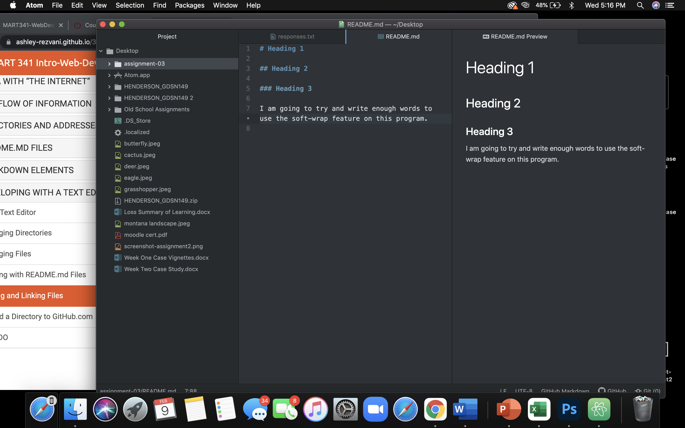

# Heading 1

## Heading 2

### Heading 3

So far in this class I have learned that I am not as computer smart as I thought I was.  There is a lot more to the internet than I ever imagined, including a lot of language that I have never even heard of before.  We only see about 80% of the web.  Each aspect of a website has to be in a certain order.

[Course Website](https://ashley-rezvani.github.io/341-web-design-Spring2022/topic-02/atom-move-file/)

[My Responses](./responses.txt)

