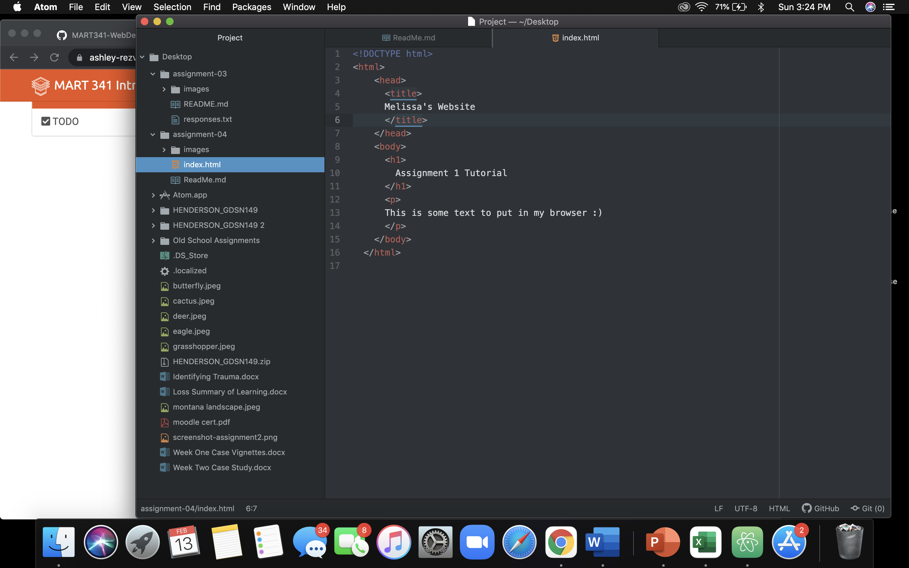

A web browser gathers information from other parts of the web and displays it on your device. The information is transferred using Hypertext Transfer protocol, which defines how text, images, and videos are viewed.
I currently use Safari and Google Chrome to surf the web.

