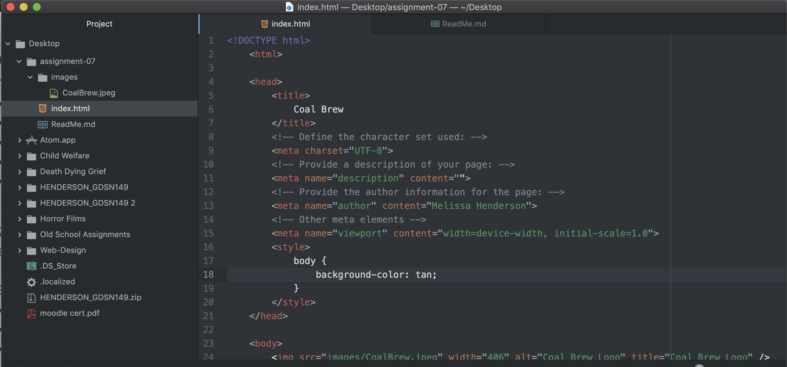

A type of form that I use all the time on the internet is a login.  It serves the purpose of putting in your email or username to login in with saved information on the site.  

Another form that I see often but do not use is a comment or review.  This is used to add your information on a post that you create so others can view it.  

One more example of a form that I always come across is a subscribe form.  This is where you enter in your email to receive updates on the website and their new releases.  
