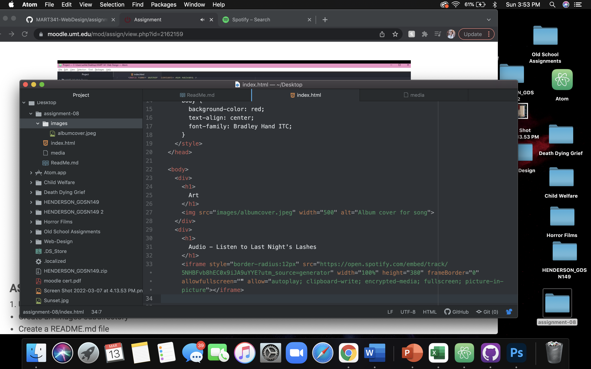

An affordance is the possibility of an object.

Advantages and Disadvantages
Ideal for video and audio files.
Can host large, high-quality versions of files.
Will handle compatibility, encoding, and the other details necessary for the media to play on a variety of browsers, without any work from you.
Not ideal for image files.
Any unlicenced materials used without permission can be crawled and reported.
Can become costly to upgrade storage and/or services.

This week I found the that adding all of these elements becomes difficult to keep track of.  The assignment video really helped with this.  I also found that I liked the way my website looked without adding the extra elements.  
