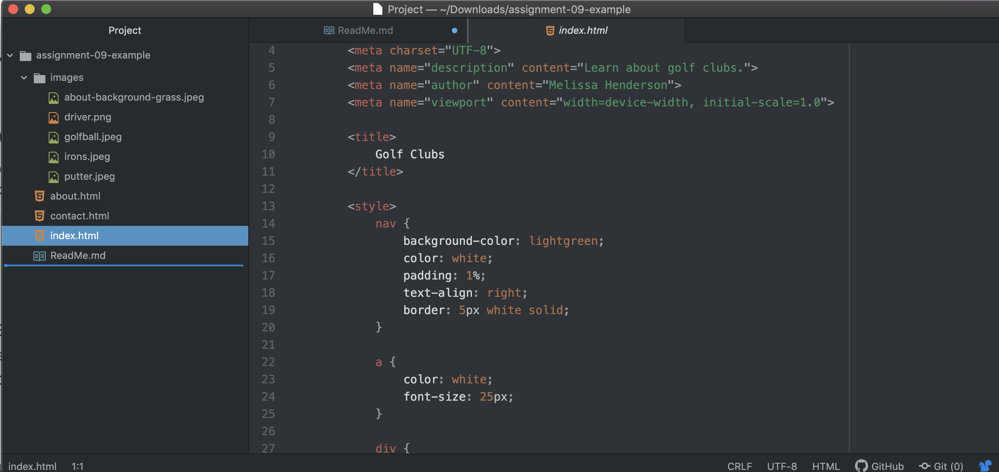

While learning HTML there was a lot to keep track of.  I think that the hardest part was trying to remember all the elements.  After that, it is mostly repetition.  

In the next section I am excited to learn more about the decorating type of elements--like changing colors and adding fonts.  
