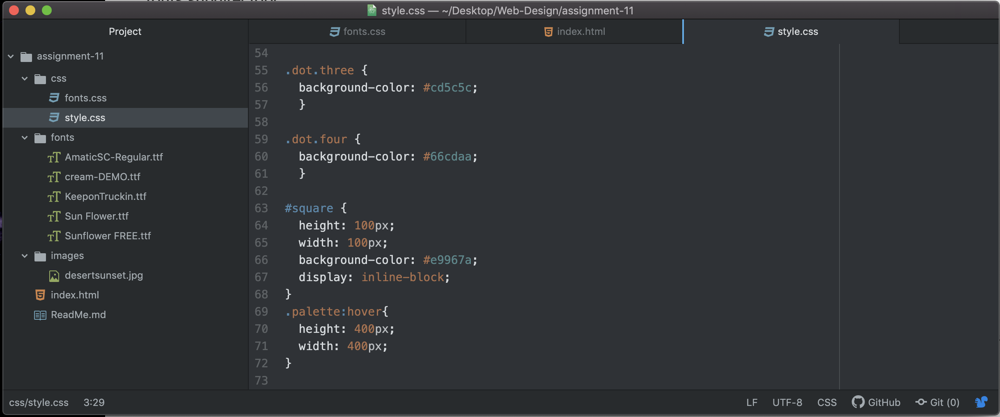

Typography is a way of arranging letters and text in a way that is legible, clear, and visually appealing to the viewer.  

Having fallback fonts are important incase the browser cannot support the first chosen font.  It then will go down the list of the fallback fonts and use those in that order.  

System fonts are those that are already downloaded onto your local device.  
Web Fonts are custom fonts hosted on a server.  They do not have to be available on the user's device to appear.  
Web-Safe fonts are those that developers can count on being available by the system.  
