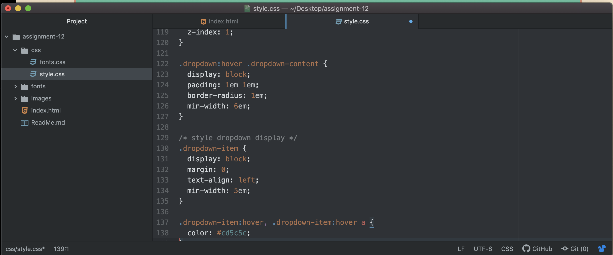

Padding is the amount of space between the inner content of the element and the element itself.

The margin is the space between the box/element and other elements, or the edge of the parent element.

A border is an outline of the content.

This week I could not figure out how to remove the interactivity elements from my buttons.  I ended up liking how it turned out so I just left them!
